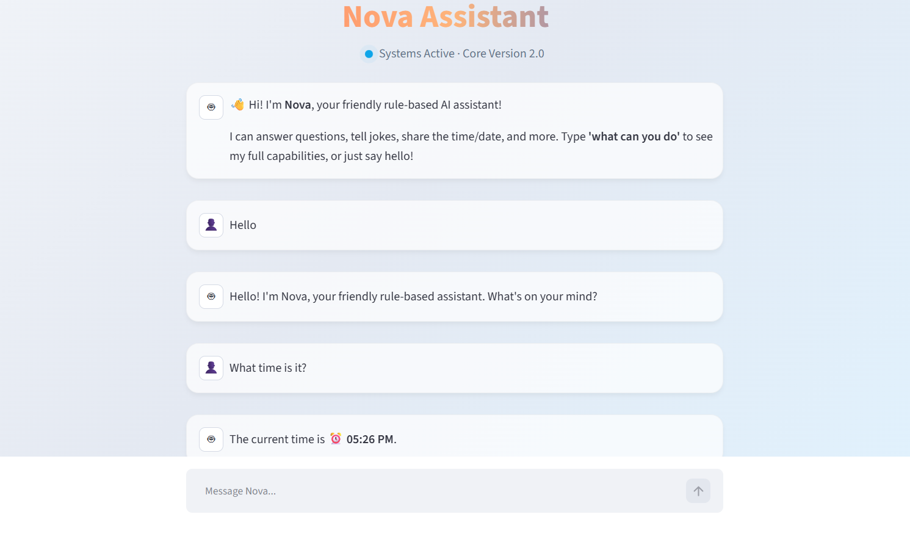
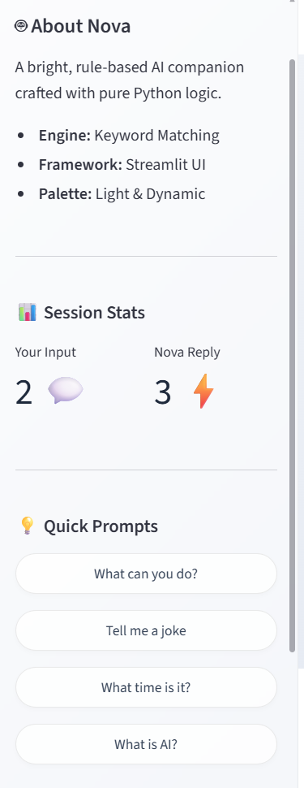

---

# 🤖 Nova — Rule-Based AI Chatbot

---

## 📌 Project Description

**Nova** is a rule-based AI chatbot web application built entirely with Python. It demonstrates fundamental AI concepts — decision-making, control flow, and rule-based response generation — without using any machine learning models or external APIs.


The project is split into two clean layers:

* **`chatbot.py`** — the brain (logic, rules, matching engine)
* **`app.py`** — the face (Streamlit UI, session management, display)

---

## 🎯 Objective

* Understand and implement rule-based AI systems
* Practice clean code architecture with separation of concerns
* Build a deployable web application using Streamlit
* Demonstrate NLP-adjacent concepts like keyword matching and input normalization

---

## ✨ Features

| Feature              | Details                                       |
| -------------------- | --------------------------------------------- |
| 👋 Greeting Handling | hello, hi, hey, good morning, good evening    |
| ❓ FAQ Responses      | name, creator, age, capabilities, how are you |
| ⏰ Live Time & Date   | Returns the actual current time/date          |
| 😂 Joke Generator    | 4 rotating programming jokes                  |
| 🔍 Partial Matching  | "tell me your name" matches "your name"       |
| 🔤 Case-Insensitive  | Input is normalized before matching           |
| 🎲 Random Responses  | Multiple replies per rule for variety         |
| 💬 Chat History      | Full session history via `st.session_state`   |
| ⚡ Quick Suggestions  | Sidebar buttons to try example prompts        |
| 🧹 Clear Chat        | Reset the entire conversation                 |
| 🚪 Exit Commands     | bye / goodbye / quit / exit / farewell        |
| 📊 Session Stats     | Live message count in the sidebar             |

---

## 🛠 Technologies Used

| Technology  | Purpose                      |
| ----------- | ---------------------------- |
| Python 3.9+ | Core programming language    |
| Streamlit   | Web UI framework             |
| random      | Random response selection    |
| datetime    | Live time and date responses |

No machine learning. No external APIs. No databases.

---

## 📁 Project Structure

```bash
Project-1-Rule-Based-Chatbot/
│
├── app.py              # Streamlit UI — input handling & chat display
├── chatbot.py          # Rule engine — logic & response matching
├── requirements.txt    # Dependencies (Streamlit only)
├── README.md           # Project documentation
└── screenshots/        # UI screenshots
```

---

## ⚙️ How the Chatbot Works

```text
User Input: "Hey! What's YOUR name?"
        │
        ▼
1. Normalize input
   → "hey! what's your name?"
        │
        ▼
2. Match keywords in rule set
   → "your name" found
        │
        ▼
3. Select response (randomized if multiple)
        │
        ▼
4. Handle special tokens (@TIME, @DATE)
        │
        ▼
5. Display response in Streamlit UI
```

---

## 🔍 Matching Strategy

Nova uses **Partial Keyword Matching**:

```python
if keyword in normalized_input:
```

✔ Flexible conversations
✔ No strict sentence matching
✔ Better user experience without ML

---

## 🚀 Installation

### Prerequisites

* Python 3.9+
* pip

### Steps

```bash
# Clone repository
git clone https://github.com/yourusername/Project-1-Rule-Based-Chatbot.git
cd Project-1-Rule-Based-Chatbot

# Create virtual environment
python -m venv venv

# Activate environment
venv\Scripts\activate   # Windows
source venv/bin/activate  # macOS/Linux

# Install dependencies
pip install -r requirements.txt
```

---

## ▶️ How to Run

```bash
streamlit run app.py
```

Then open:

```
http://localhost:8501
```

---

## 📸 Screenshots

| Chat Interface                | Sidebar                             |
| ----------------------------- | ----------------------------------- |
|  |  |

---

## 💬 Example Conversations

```text
You: Hello!
Nova: Hey there! 👋 I'm Nova. How can I help you today?

You: What can you do?
Nova: 💬 Chat & Answer Questions...
      🧠 Rule-Based Responses...
      🕐 Time & Date support...

You: Tell me a joke
Nova: Why do programmers prefer dark mode? Because light attracts bugs! 🐛😂

You: What time is it?
Nova: The current time is ⏰ 02:30 PM.

You: bye
Nova: Goodbye! 👋 It was great chatting with you.
```

---

## 🚀 Possible Improvements

* Add weather integration
* Sentiment detection
* User memory (name recall)
* Export chat history
* Text-to-speech support
* Deploy on Streamlit Cloud
* Multi-language support

---

## 👨‍💻 Author

Built as part of an internship project to demonstrate **rule-based AI and Python web development**.

---

## 📄 License

This project is open source and available under the MIT License.

---
