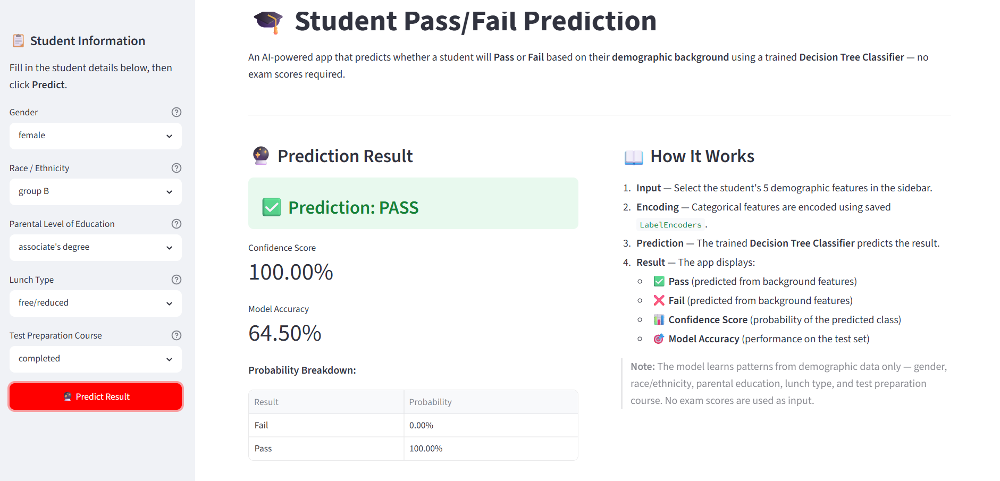
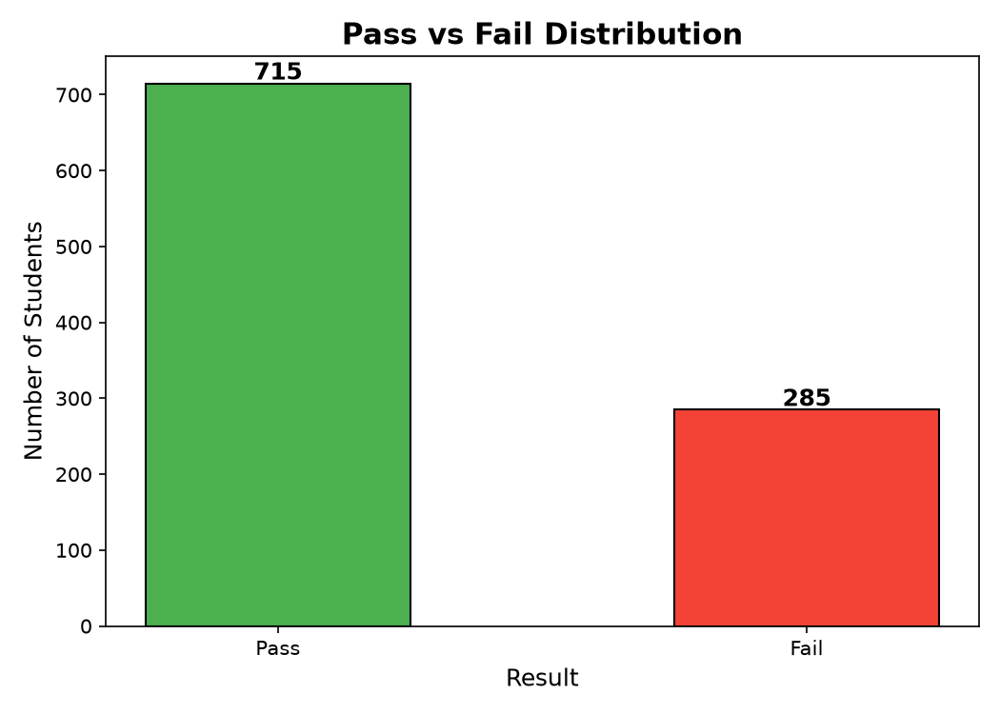
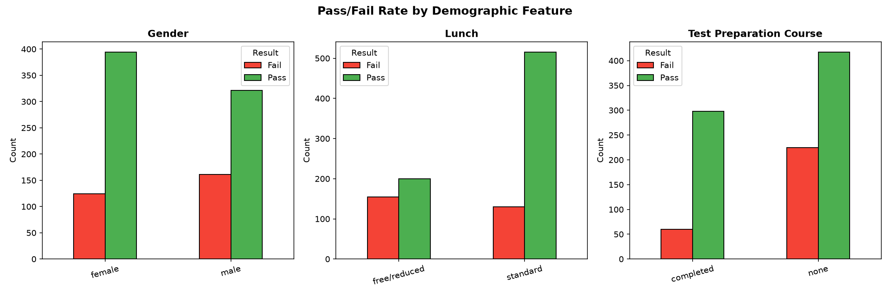
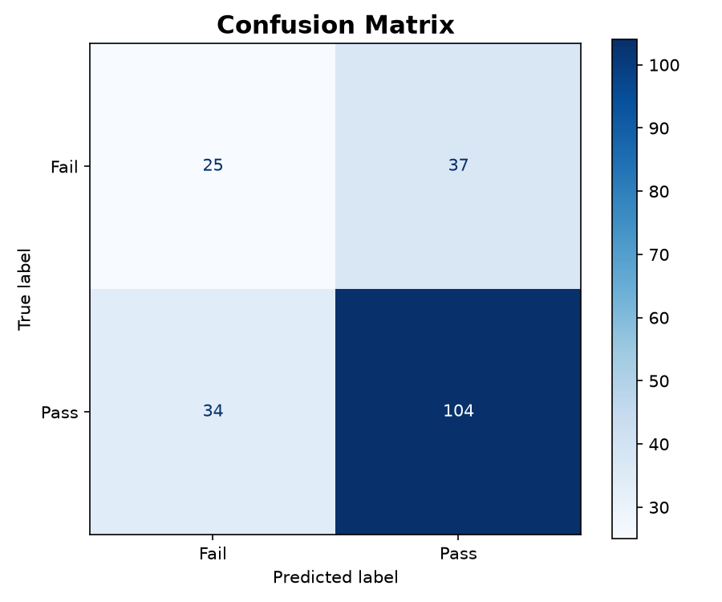

# Student Pass/Fail Prediction Using AI

> A beginner-friendly Machine Learning project that predicts whether a student will **Pass** or **Fail** based on demographic information and exam scores, using a **Decision Tree Classifier** and a live **Streamlit** web app.

---

## Project Overview

This project builds an end-to-end Machine Learning pipeline:

- Loads real student performance data
- Engineers a binary target column (`Pass` / `Fail`)
- Trains a **Decision Tree Classifier**
- Exposes predictions through an interactive **Streamlit** web application
- Displays confidence scores, model accuracy, and data visualizations

---

## Objective

Predict whether a student will **Pass** or **Fail** based on:

| Feature | Type |
|---|---|
| Gender | Categorical |
| Race / Ethnicity | Categorical |
| Parental Level of Education | Categorical |
| Lunch Type | Categorical |
| Test Preparation Course | Categorical |
| Math Score | Numerical (0–100) |
| Reading Score | Numerical (0–100) |
| Writing Score | Numerical (0–100) |

**Pass/Fail Rule:**

```
Average Score = (Math + Reading + Writing) / 3
If Average Score >= 60  →  Pass
If Average Score <  60  →  Fail
```

---

## Dataset Information

| Property | Detail |
|---|---|
| **Name** | Students Performance in Exams |
| **Source** | Kaggle |
| **Rows** | 1,000 students |
| **Columns** | 8 features + 1 target |
| **Format** | CSV |

**Dataset Source:** [https://www.kaggle.com/datasets/spscientist/students-performance-in-exams](https://www.kaggle.com/datasets/spscientist/students-performance-in-exams)

Download `StudentsPerformance.csv` and place it inside the `data/` folder.

---

## Technologies Used

| Technology | Purpose |
|---|---|
| **Python 3.11** | Core programming language |
| **Streamlit** | Web application framework |
| **scikit-learn** | Machine Learning (Decision Tree, LabelEncoder) |
| **Pandas** | Data loading and manipulation |
| **NumPy** | Numerical operations |
| **Matplotlib** | Static data visualizations |
| **Pickle** | Model serialization |

---

## Installation Steps

### 1. Clone the Repository

```bash
git clone https://github.com/your-username/Student-Pass-Fail-Prediction.git
cd Student-Pass-Fail-Prediction
```

### 2. Create a Virtual Environment (Recommended)

```bash
python -m venv venv

# Windows
venv\Scripts\activate

# macOS / Linux
source venv/bin/activate
```

### 3. Install Dependencies

```bash
pip install -r requirements.txt
```

### 4. Download the Dataset

Download `StudentsPerformance.csv` from:
[https://www.kaggle.com/datasets/spscientist/students-performance-in-exams](https://www.kaggle.com/datasets/spscientist/students-performance-in-exams)

Place the file at:
```
Student-Pass-Fail-Prediction/
└── data/
    └── StudentsPerformance.csv
```

---

## How to Run

### Step 1 — Train the Model

```bash
python train_model.py
```

This will:
- Load and preprocess the dataset
- Train the Decision Tree Classifier
- Save `model.pkl`, `encoders.pkl`, `accuracy.pkl`
- Generate visualization images in `screenshots/`

**Expected output:**
```
Dataset loaded: 1000 rows, 8 columns
Decision Tree trained successfully.
Model Accuracy: XX.XX%
model.pkl saved.
encoders.pkl saved.
accuracy.pkl saved.
```

### Step 2 — Launch the Streamlit App

```bash
streamlit run app.py
```

Open your browser at: `http://localhost:8501`

---

## Model Performance

| Metric | Value |
|---|---|
| **Algorithm** | Decision Tree Classifier |
| **Train / Test Split** | 80% / 20% |
| **Accuracy** | ~64.50% |
| **Features** | 8 (5 categorical + 3 numerical) |
| **Target Classes** | Pass, Fail |

---

## Screenshots

### Streamlit App — Prediction Page


### Pass/Fail Distribution


### Feature Distribution


### Confusion Matrix

---

## Future Improvements

1. **Add more algorithms** — Compare Random Forest, SVM, Logistic Regression, and XGBoost performance side-by-side.
2. **Hyperparameter tuning** — Use `GridSearchCV` or `RandomizedSearchCV` to find optimal Decision Tree parameters.
3. **Feature importance chart** — Visualize which features contribute most to the prediction.
4. **Cross-validation** — Implement k-fold cross-validation for more robust accuracy estimates.
5. **Expanded dataset** — Combine with other student performance datasets for better generalization.
6. **SHAP explainability** — Add SHAP values to explain individual predictions.
7. **Download predictions** — Allow users to upload a CSV of multiple students and download batch predictions.
8. **Deployment** — Deploy the app to Streamlit Cloud, Heroku, or AWS.

---

## Project Structure

```
Student-Pass-Fail-Prediction/
│
├── data/
│   └── StudentsPerformance.csv     ← Kaggle dataset (download manually)
│
├── screenshots/
│   ├── pass_fail_distribution.png  ← Generated by train_model.py
│   ├── correlation_heatmap.png     ← Generated by train_model.py
│   └── confusion_matrix.png        ← Generated by train_model.py
│
├── .streamlit/
│   └── config.toml                 ← Streamlit server configuration
│
├── train_model.py                  ← Model training script
├── app.py                          ← Streamlit web application
├── model.pkl                       ← Trained model (generated by train_model.py)
├── encoders.pkl                    ← Label encoders (generated by train_model.py)
├── accuracy.pkl                    ← Model accuracy (generated by train_model.py)
├── requirements.txt                ← Python dependencies
├── README.md                       ← Project documentation
└── .gitignore                      ← Git ignore rules
```

---

## License

This project is open-source and free to use for educational and personal purposes.

---

## Acknowledgements

- Dataset by [SP Scientist on Kaggle](https://www.kaggle.com/datasets/spscientist/students-performance-in-exams)
- Built with [Streamlit](https://streamlit.io/) and [scikit-learn](https://scikit-learn.org/)
