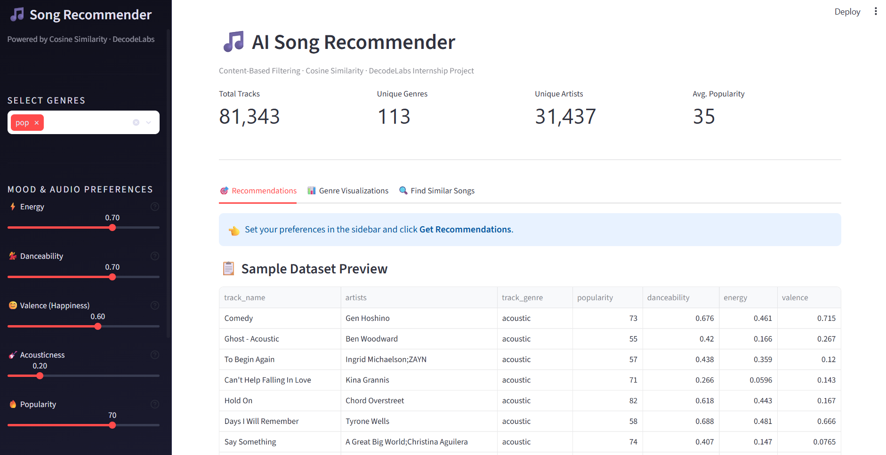
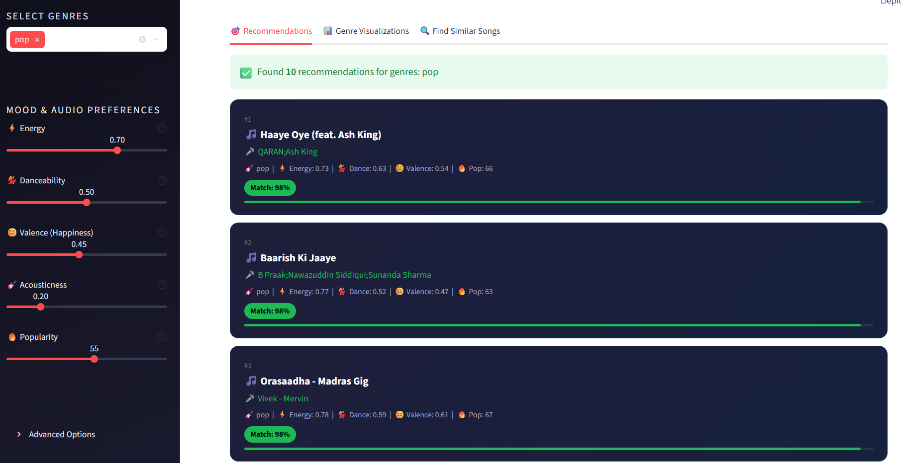
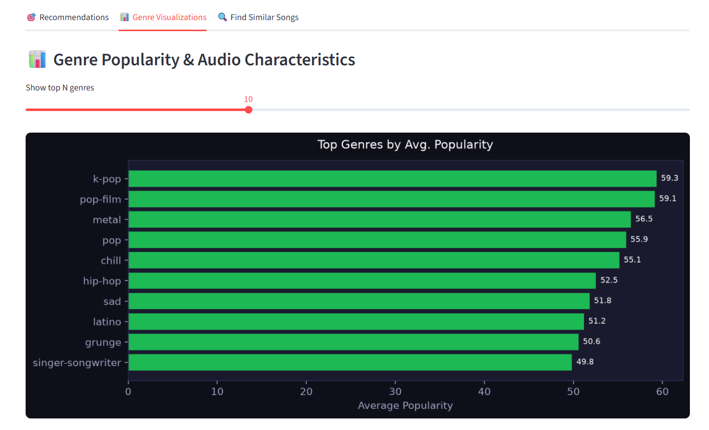
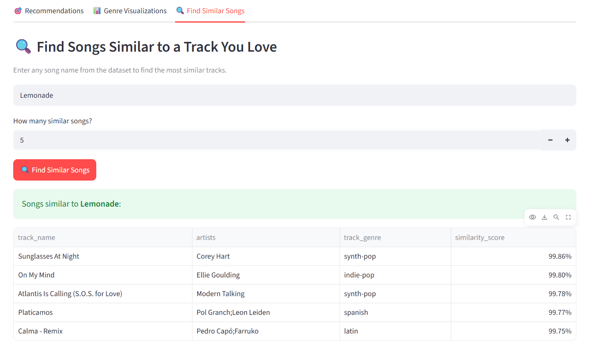

# Spotify AI Song Recommender

> A content-based music recommendation system built with Python, Scikit-Learn, and Streamlit.
> **DecodeLabs Internship Project — AI Recommendation Logic**


---

## Project Overview

This project implements a **Content-Based Recommendation System** that suggests Spotify tracks based on user audio preferences. Given that a user prefers certain genres and mood characteristics (energy, danceability, valence, etc.), the system computes a **Cosine Similarity** score between the user's ideal song profile and every track in the dataset, then returns the top matches.

---

## Features

| Feature | Description |
|---|---|
| Genre Filtering | Select one or multiple genres to narrow the search pool |
| Mood Sliders | Fine-tune energy, danceability, happiness, and acousticness |
| Cosine Similarity | Mathematically rigorous similarity scoring using Scikit-Learn |
| Visualizations | Genre popularity charts, energy vs danceability scatter plots |
| Similar Song Finder | "More Like This" feature for any track in the dataset |
| CSV Download | Export your recommendations with one click |
| Fast & Cached | Dataset loads once per session via Streamlit's caching |

---

## Project Structure

```
spotify-recommender/
│
├── app.py                  # Streamlit web application (UI layer)
├── recommendation.py       # Core recommendation engine (logic layer)
├── data_preprocessing.py   # Data loading, cleaning & normalization
├── requirements.txt        # Python dependencies
├── README.md               # This file
├── spotify_tracks.csv      # Dataset (download separately — see below)
└── screenshots/            # UI screenshots for the README
```

---

## Dataset

**Spotify Tracks Dataset** by Maharshi Pandya  
[Download from Kaggle](https://www.kaggle.com/datasets/maharshipandya/-spotify-tracks-dataset)

Place the downloaded `dataset.csv` file in the project root and rename it to `spotify_tracks.csv`.

### Key Columns Used

| Column | Description | Role |
|---|---|---|
| `track_name` | Song title | Display |
| `artists` | Artist name(s) | Display |
| `track_genre` | Music genre | Filtering |
| `popularity` | Spotify popularity score (0–100) | Feature |
| `danceability` | Suitability for dancing (0–1) | Feature |
| `energy` | Perceived intensity (0–1) | Feature |
| `valence` | Musical positiveness/happiness (0–1) | Feature |
| `acousticness` | Acoustic vs. electronic (0–1) | Feature |
| `speechiness` | Spoken word presence (0–1) | Feature |
| `instrumentalness` | Likelihood of no vocals (0–1) | Feature |
| `liveness` | Live audience presence (0–1) | Feature |
| `tempo` | Beats per minute | Feature |

---

## Installation & Setup

### 1. Clone the repository
```bash
git clone https://github.com/YOUR_USERNAME/spotify-recommender.git
cd spotify-recommender
```

### 2. Create a virtual environment (recommended)
```bash
python -m venv venv
source venv/bin/activate        # macOS / Linux
venv\Scripts\activate           # Windows
```

### 3. Install dependencies
```bash
pip install -r requirements.txt
```

### 4. Download the dataset
Download `spotify_tracks.csv` from [Kaggle](https://www.kaggle.com/datasets/maharshipandya/-spotify-tracks-dataset) and place it in the project root.

### 5. Run the app
```bash
streamlit run app.py
```

The app will open in your browser at `http://localhost:8501`.

---

## Usage

1. **Select genres** from the sidebar dropdown (e.g., pop, rock, jazz).
2. **Adjust mood sliders** — energy, danceability, valence, acousticness, popularity.
3. Click **"Get Recommendations"**.
4. Browse the top-10 matched songs with similarity scores.
5. Switch to the **Visualizations** tab for genre analytics.
6. Use **Find Similar Songs** to discover tracks similar to a song you love.
7. **Download** your recommendations as a CSV file.

---

## Screenshots

### Home Page


### Recommendation Results


### Genre Analysis


### Similar Songs


## How the Recommendation Algorithm Works

1. **Preprocessing** — Load dataset, drop nulls/duplicates, normalize features to [0, 1].
2. **Genre Filter** — Narrow the candidate pool to the selected genres.
3. **User Vector** — Convert slider values into a 9-dimensional preference vector.
4. **Cosine Similarity** — Score each candidate song against the user vector.
5. **Ranking** — Sort scores descending; return top-N.

```
Cosine Similarity = (A · B) / (‖A‖ × ‖B‖)

where A = song feature vector
      B = user preference vector
```

---

## Future Improvements

- Collaborative Filtering (user-user or item-item) for personalised recommendations
- Spotify OAuth integration to use user's real listening history
- Neural embedding model (Word2Vec / Two-Tower) for richer representation
- A/B testing framework to evaluate recommendation quality
- Docker containerisation for easy deployment
- PostgreSQL backend for user session persistence

---

## Tech Stack

| Technology | Purpose |
|---|---|
| Python 3.10+ | Core programming language |
| Pandas | Data loading & manipulation |
| NumPy | Numerical computation |
| Scikit-Learn | Cosine similarity calculation |
| Streamlit | Web application framework |
| Matplotlib | Data visualisations |

---

## Author
 
Built as part of the AI/ML internship programme.

---

## License

This project is licensed under the MIT License.
